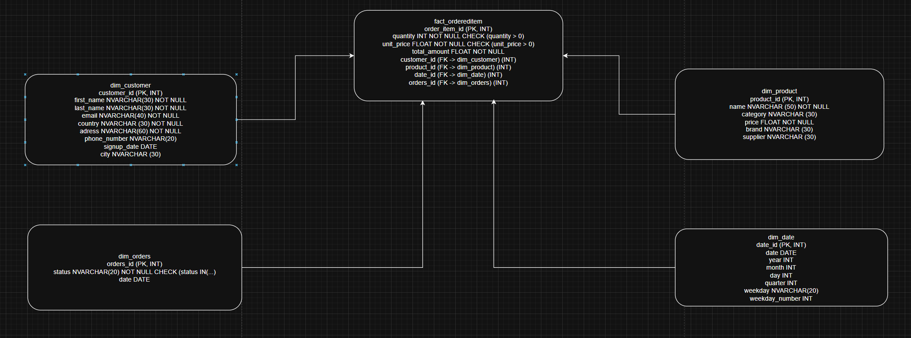
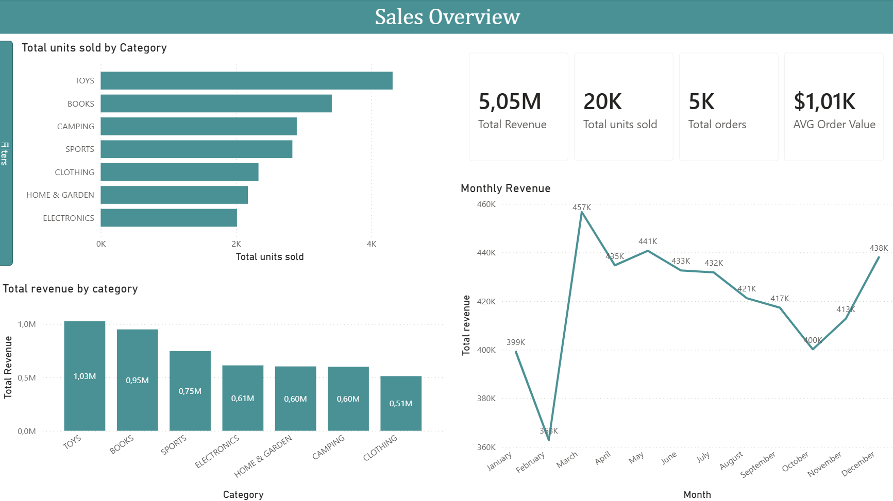
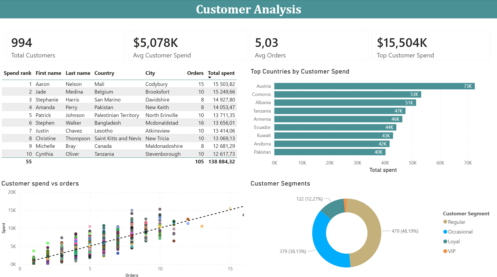
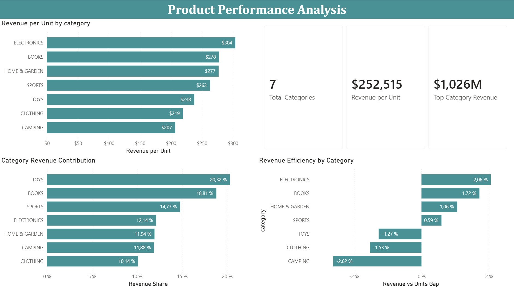

# E-commerce Sales Analytics on Azure

## Overview

An end-to-end cloud-based data analytics project built on Azure. The pipeline generates synthetic e-commerce sales data, stores raw files in Azure Blob Storage, loads them into Azure SQL Database, transforms the data using dbt, and visualizes business insights through interactive Power BI dashboards.

The goal of the project was to gain hands-on experience with modern data engineering and analytics tools, including Azure cloud services and dbt transformations. This project provided hands-on experience with **dbt** and **Azure**, exploring staging models, analytical marts and modular SQL transformations within a modern ELT workflow.

---

## Tech Stack

* **Python** – data generation and pipeline orchestration
* **Azure Blob Storage** – cloud storage for raw datasets
* **Azure SQL Database** – cloud data warehouse
* **dbt** – data transformation and modeling
* **Power BI** – dashboarding and business intelligence
* **SQL** – data modeling and analytical queries
* **Git & GitHub** – version control
* **Libraries** – `faker`, `pandas`, `sqlalchemy`, `pyodbc`, `python-dotenv`

---

## Architecture

The project follows a modern ELT workflow:

1. **Generate** – Python generates synthetic e-commerce datasets using Faker
2. **Store** – Raw CSV files are uploaded to Azure Blob Storage
3. **Load** – Data is loaded into Azure SQL Database
4. **Transform** – dbt creates staging and analytical models
5. **Analyze** – Power BI connects to analytical marts for reporting

```text
Python
   ↓
Azure Blob Storage
   ↓
Azure SQL Database
   ↓
dbt
   ↓
Analytical Data Marts
   ↓
Power BI
```

---

## Star Schema

The analytical model is based on a star schema design consisting of one fact table and four dimensions.



### Fact Table
* fact_ordereditem

### Dimension Tables
* dim_customer
* dim_product
* dim_orders
* dim_date

---

## Project Structure

```text
ecommerce-sales-analytics/
├── docs/
│   └── screenshots/            - Dashboard and schema screenshots
├── ecommerce_dbt/
│   ├── models/
│   │   ├── staging/            - Cleaned and standardized source models
│   │   │   ├── stg_customers.sql
│   │   │   ├── stg_products.sql
│   │   │   ├── stg_orders.sql
│   │   │   ├── stg_date.sql
│   │   │   └── stg_fact.sql
│   │   └── marts/              - Analytical models for Power BI
│   │       ├── sales_by_category.sql
│   │       ├── monthly_revenue.sql
│   │       └── top_customers.sql
│   └── dbt_project.yml         - dbt project configuration
├── sql/
│   └── create_tables.sql       - Azure SQL schema definition
├── src/
│   ├── generate_data.py        - Generates synthetic data with Faker
│   ├── upload_to_blob.py       - Uploads CSV files to Azure Blob Storage
│   ├── load.py                 - Loads data from Blob into Azure SQL
│   └── test_connections.py     - Tests Azure connections
├── .env.example                - Environment variable template
├── requirements.txt
└── README.md
```

---

## Setup & Installation

### Prerequisites
- Python 3.10+
- Azure account with Blob Storage and SQL Database
- dbt (`pip install dbt-sqlserver`)
- Power BI Desktop

### Installation

1. Clone the repository
```bash
git clone https://github.com/Denillox/ecommerce-sales-analytics.git
cd ecommerce-sales-analytics
```

2. Create and activate a virtual environment
```bash
python -m venv .venv
.venv\Scripts\activate
pip install -r requirements.txt
```

3. Create `.env` from `.env.example` and fill in your Azure credentials
```
AZURE_STORAGE_CONNECTION_STRING=your_storage_connection_string
AZURE_SQL_CONNECTION_STRING=your_sql_connection_string
```

4. Run the pipeline
```bash
python src/generate_data.py
python src/upload_to_blob.py
python src/load.py
cd ecommerce_dbt && dbt run
```

---

## Dashboard Insights

### Sales Overview

Provides a high-level overview of business performance.

Key insights:
* Total revenue exceeded $5M
* Toys and Books generate the highest revenue
* Revenue remains relatively stable throughout the year
* Average order value exceeds $1,000



---

### Customer Analysis

Focuses on customer behavior and spending patterns.

Key insights:
* Customer spending increases strongly with order frequency
* A small number of customers generate significantly higher revenue
* Customer segments reveal differences between regular, occasional and loyal buyers
* Customer value varies considerably across countries



---

### Product Performance Analysis

Evaluates category efficiency and profitability.

Key insights:
* Electronics generates the highest revenue per unit sold
* Camping sells relatively high volumes but contributes less revenue
* Revenue contribution differs significantly across categories
* Revenue efficiency highlights categories that outperform their sales volume



---

## dbt Models

### Staging Models
Used to clean, standardize, and prepare source data.

* `stg_customers` – cleaned customer data
* `stg_products` – cleaned product data
* `stg_orders` – cleaned orders data
* `stg_date` – standardized date dimension
* `stg_fact` – validated fact table

### Mart Models
Business-ready analytical datasets used by Power BI.

* `monthly_revenue` – revenue trends by month and year
* `sales_by_category` – total revenue and units sold per category
* `top_customers` – customers ranked by total spend using window functions

---

## Skills Demonstrated

### Data Engineering
* Cloud storage using Azure Blob Storage
* Data loading into Azure SQL Database
* Environment variable management
* ETL/ELT pipeline development

### SQL & Data Modeling
* Star schema design
* Joins and aggregations
* Analytical SQL queries
* Window functions
* Common Table Expressions (CTEs)

### dbt
* Staging models
* Mart models
* Data transformation workflows
* Data quality validation

### Business Intelligence
* DAX measures
* KPI design
* Customer segmentation
* Product performance analysis
* Interactive dashboard development

---

## Key Learnings

This project was built to strengthen my understanding of modern cloud-based analytics workflows.

Key areas of growth included:
- Building an end-to-end pipeline using Azure services
- Learning dbt for data transformations and analytical modeling
- Creating reusable staging and mart layers
- Connecting Python, Azure, SQL, dbt, and Power BI into a single workflow

The most valuable part of the project was learning how dbt fits into a modern data stack and how analytical models can be structured to support business reporting.

---

## Future Improvements

* Implement incremental dbt models
* Orchestrate workflows with Azure Data Factory
* Deploy dashboards to Power BI Service
* Add CI/CD workflows through GitHub Actions
* Introduce automated pipeline scheduling